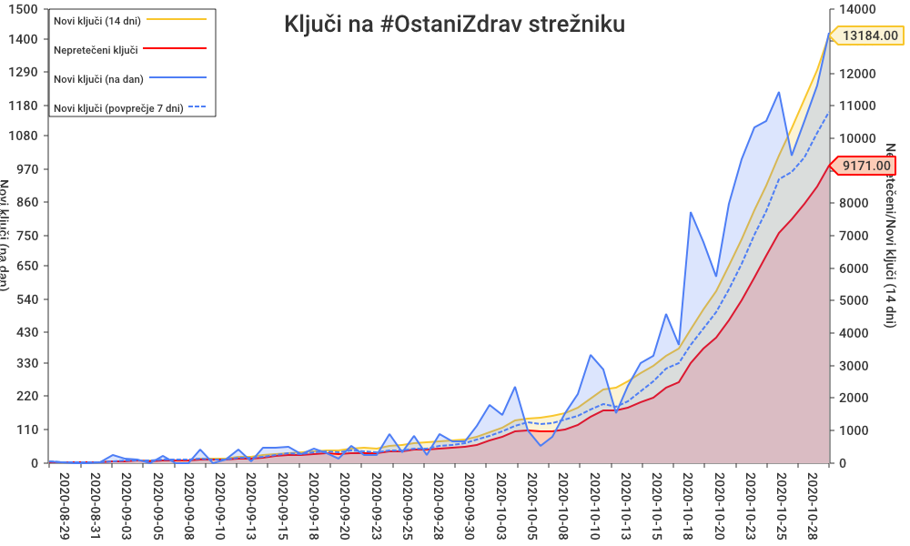

# Temporary Exposure Key Export scraper

:warning: Please note:
* :bug: In [February 2021 the service started to include data from other countries](https://slovenia.representation.ec.europa.eu/novice-dogodki/novice-0/aplikacija-ostanizdrav-tudi-cez-mejo-2021-02-12_sl), so it became less important indicator of local Covid spread (see 📈 the big jump in the chart)
* 💀 In April 2022 the services access was unexpectedly limited to some (foreign?) IPs, breaking the access to GitHub workflow servers, which were [performing the :robot: scraping](https://github.com/sledilnik/cwa-scrape/actions/workflows/make.yml), breaking the time series (see 📉 the last drop to 0 in the chart). 
* :coffin: Finally the [#OstaniZdrav application and all related services were stopped on 2023-03-31](https://www.gov.si/novice/2023-03-30-prenehanje-delovanja-aplikacije-ostanizdrav/), so the code in this repository became unused and unmaintained.
* :file_cabinet: Repository was **archived on 2023-08-19**. You can still fork it or we can un-archive it if needed later on.
* :floppy_disk: Data can also be found on:
  * [sledilnik/data/ostanizdrav](https://github.com/sledilnik/data/tree/master/ostanizdrav) and
  * [:slovenia: government's OpenData portal](https://podatki.gov.si/dataset/statisticni-podatki-aplikacije-ostanizdrav).

---
[](https://github.com/sledilnik/cwa-scrape/actions)

Periodically scrapes the daily data from [Slovenian contact tracing app #OstaniZdrav](https://www.gov.si/ostanizdrav) and publishes it into this git repository into [data/SI](data/SI) directory.

After scraping all the data, it aggregates some statistics into [keycount.csv](data/SI/keycount.csv) and [.json](data/SI/keycount.json), which is then plotted onto the [keycount.png](data/SI/keycount.png) chart:



## Requirements

GNU Make, [Go](https://golang.org) 1.17 or later, [jq](https://stedolan.github.io/jq/) 1.6 or later.

```bash
$ sudo apt install golang jq
```

## Running

It is ran hourly on GitHub servers using github [action](.github/workflows/make.yml). To run it locally just do:

```bash
$ make
```

## Tools & Libraries used

* [Export analyzer tool](https://github.com/google/exposure-notifications-server/tree/main/tools/export-analyzer) from [Google exposure notification server](https://github.com/google/exposure-notifications-server)
* [github.com/wcharczuk/go-chart](https://github.com/wcharczuk/go-chart) charting library for Go
* [github.com/gocarina/gocsv](https://github.com/gocarina/gocsv) CSV library for Go

## Acknowledgements

This project was inspired by a devoted team of [sledilnik.org](https://sledilnik.org), a covid-19 tracker for Slovenia. Other related projects can be found at [:octocat: GitHub](https://github.com/sledilnik).
