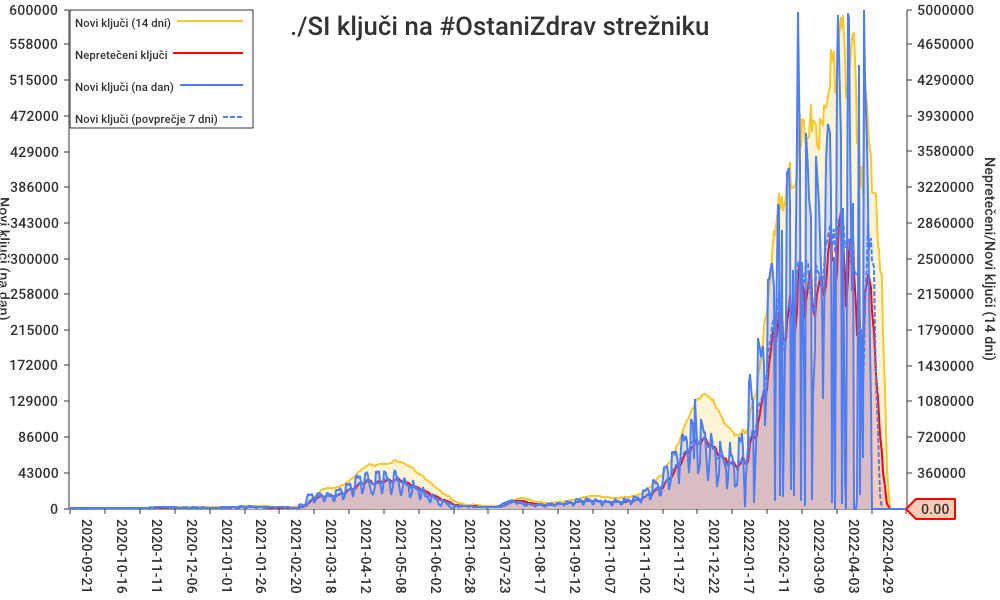

# Temporary Exposure Key Export scraper

[](https://github.com/stefanb/cwa-scrape/actions)

Periodically scrapes the daily data from [Slovenian contact tracing app #OstaniZdrav](https://www.gov.si/ostanizdrav) and publishes it into this git repository into [data/SI](data/SI) directory.

After scraping all the data, it aggregates some statistics into [keycount.csv](data/SI/keycount.csv) and [.json](data/SI/keycount.json), which can be used to produce charts like:



## Requirements

GNU Make, [Go](https://golang.org) 1.15 or later, [jq](https://stedolan.github.io/jq/) 1.6 or later.

```bash
$ sudo apt install golang jq
```

## Running

It is ran hourly on GitHub servers using github [action](.github/workflows/make.yml). To run it locally just do:

```bash
$ make
```

## Acknowledgements

This project was inspired by a devoted team of [sledilnik.org](https://sledilnik.org), a covid-19 tracker for Slovenia. Other related projects can be found at [:octocat: GitHub](https://github.com/sledilnik).
