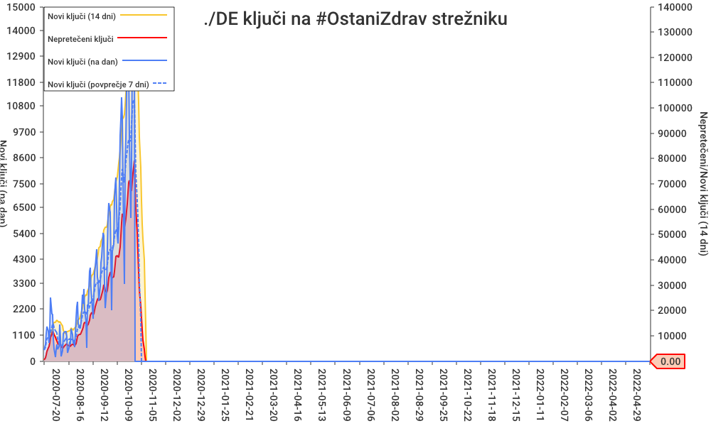

# German Corona Warn App data

Aggregates: [keycount.csv](keycount.csv) and [.json](keycount.json)

Chart [keycount.png](keycount.png) chart:



## Data source

Fresh data from https://svc90.cwa.gov.si/version/v1/

Initial historical `*.zip` key exports from archive https://ctt.pfstr.de/ imported using `wget`:

```bash
$ cd data/DE/
$ wget -A zip -r -l 1 -nd https://ctt.pfstr.de/
```
